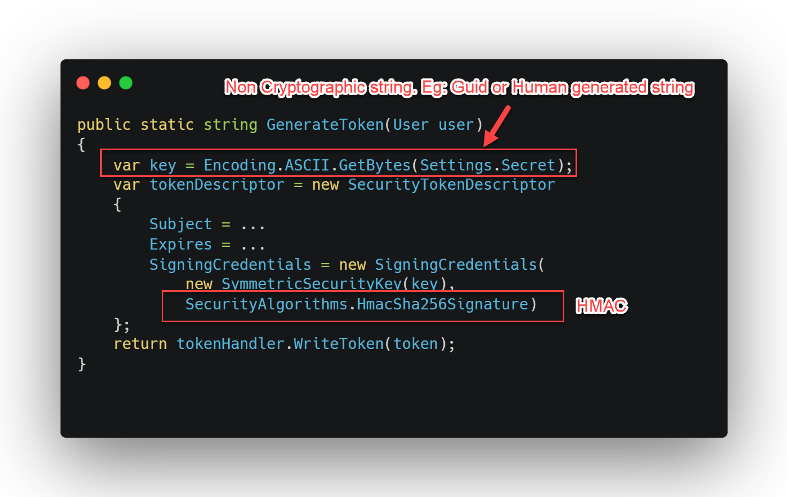

# JWT Key Management for .NET - Generate and auto rotate Cryptographic Keys for your Jwt
<p align="center">
    
</p>

## Are you creating Jwt like this?
<p align="center">
    
</p>


## Let me tell you: You have a problem.

------------------
<br>

[](https://github.com/NetDevPack/Security.Jwt/actions/workflows/publish-package.yml)


The goal of this project is to help your application security by Managing your JWT.

* Auto create RSA or ECDsa keys
* Support for JWE
* Publish a endpoint with your public key in JWKS format
* Support for multiple API's to consume the JWKS endpoint
* Auto rotate key every 90 days (Best current practices for Public Key Rotation)
* Remove old private keys after key rotation (NIST Recommendations)
* Use recommended settings for RSA & ECDSA (RFC 7518 Recommendations)
* Uses random number generator to generate keys for JWE with AES CBC (dotnet does not support RSA-OAEP with Aes128GCM)
* By default Save keys in same room of ASP.NET DataProtection (The same place where ASP.NET save the keys to to cryptograph MVC cookies)

It generates Keys way better with RSA and ECDsa algorithms. Which is most recommended by [RFC 7518](https://datatracker.ietf.org/doc/html/rfc7518).

# Installing

```bash
dotnet add package NetDevPack.Security.Jwt.AspNetCore
```

Now you need to configure `Startup.cs` and inject `IJwtService` to generate tokens.

## Token Configuration

```c#
builder.Services.AddAuthentication(JwtBearerDefaults.AuthenticationScheme).AddJwtBearer(options =>
{
    options.TokenValidationParameters = new TokenValidationParameters
    {
        ValidateIssuer = true,
        ValidateAudience = true,
        ValidateLifetime = true,
        ValidateIssuerSigningKey = true,
        ValidIssuer = "NetDevPack", 
        ValidAudience = "NetDevPack.AspNet.SymetricKey"
    };
});
builder.Services.AddAuthorization();
builder.Services.AddJwksManager().UseJwtValidation();
builder.Services.AddMemoryCache();
```

## Generating Tokens:

```c#

public AuthController(IJwtService jwtService)
{
    _jwtService = jwtService;
}

private string GenerateToken(User user)
{
    var tokenHandler = new JwtSecurityTokenHandler();
    var currentIssuer = $"{ControllerContext.HttpContext.Request.Scheme}://{ControllerContext.HttpContext.Request.Host}";

    var key = _jwtService.GetCurrentSigningCredentials(); // (ECDsa or RSA) auto generated key
    var token = tokenHandler.CreateToken(new SecurityTokenDescriptor
    {
        Issuer = currentIssuer,
        Subject = identityClaims,
        Expires = DateTime.UtcNow.AddHours(1),
        SigningCredentials = key
    });
    return tokenHandler.WriteToken(token);
}
```


<p align="center">
    
</p>

## Table of Contents ##

- [JWT Key Management for .NET - Generate and auto rotate Cryptographic Keys for your Jwt](#jwt-key-management-for-net---generate-and-auto-rotate-cryptographic-keys-for-your-jwt)
  - [Are you creating Jwt like this?](#are-you-creating-jwt-like-this)
  - [Let me tell you: You have a problem.](#let-me-tell-you-you-have-a-problem)
  - [Generating Tokens:](#generating-tokens)
  - [Token Validation](#token-validation)
  - [Table of Contents](#table-of-contents)
- [🛡️ What is](#️-what-is)
- [ℹ️ Installing](#ℹ️-installing)
- [❤️ Generating Tokens](#️-generating-tokens)
- [✔️ Validating Token (Jws)](#️-validating-token-jws)
- [⛅ Multiple API's - Use Jwks](#-multiple-apis---use-jwks)
    - [Identity API (Who emits the token)](#identity-api-who-emits-the-token)
  - [Client API](#client-api)
- [💾 Store](#-store)
  - [Database](#database)
  - [File system](#file-system)
- [Samples](#samples)
- [Changing Algorithm](#changing-algorithm)
  - [Jws](#jws)
  - [Jwe](#jwe)
- [IdentityServer4 - Auto jwks_uri Management](#identityserver4---auto-jwks_uri-management)
- [Why](#why)
  - [Load Balance scenarios](#load-balance-scenarios)
  - [Best practices](#best-practices)
- [License](#license)

------------------

# 🛡️ What is


The JSON Web Key Set (JWKS) is a set of keys which contains the public keys used to verify any JSON Web Token (JWT) issued by the authorization server. 
The main goal of this component is to provide a centralized store and Key Rotation of your JWK. It also provide features to generate best practices JWK.
It has a plugin for IdentityServer4, giving hability to rotating jwks_uri every 90 days and auto manage your jwks_uri.

If your API or OAuth 2.0 is under Load Balance in Kubernetes, or docker swarm it's a must have component. It work in the same way DataProtection Key of ASP.NET Core.

This component generate, store and manage your JWK. It keep a centralized store to share between your instances. By default after a 3 months a new key will be generated. 

You can expose the JWK through a JWKS endpoint and share it with your API's.

# ℹ️ Installing

At your API install `NetDevPack.Security.Jwt`:

```bash
dotnet add package NetDevPack.Security.Jwt.AspNetCore
```

Or via the .NET Core command line interface:

```
    dotnet add package NetDevPack.Security.Jwt.AspNetCore
```

Go to your `startup.cs` and change Configure:

```c#
public void ConfigureServices(IServiceCollection services)
{
    services.AddJwksManager().UseJwtValidation();
}
```

# ❤️ Generating Tokens

Usually we say Jwt. But in most cases we are trying to create a Jws.


```c#
public AuthController(IJwtService jwtService)
{
    _jwtService = jwtService;
}

private string GenerateToken(User user)
{
    var tokenHandler = new JwtSecurityTokenHandler();
    var currentIssuer = $"{ControllerContext.HttpContext.Request.Scheme}://{ControllerContext.HttpContext.Request.Host}";

    var key = _jwtService.GetCurrentSigningCredentials(); // (ECDsa or RSA) auto generated key
    var token = tokenHandler.CreateToken(new SecurityTokenDescriptor
    {
        Issuer = currentIssuer,
        Subject = identityClaims,
        Expires = DateTime.UtcNow.AddHours(1),
        SigningCredentials = key
    });
    return tokenHandler.WriteToken(token);
}
```

# ✔️ Validating Token (Jws)

Use the same service to get the current key and validate the token.

```csharp

public AuthController(IJwtService jwtService)
{
    _jwtService = jwtService;
}

private string ValidateToken(string jwt)
{
    var handler = new JsonWebTokenHandler();
    var currentIssuer = $"{ControllerContext.HttpContext.Request.Scheme}://{ControllerContext.HttpContext.Request.Host}";

    var result = handler.ValidateToken(jwt,
        new TokenValidationParameters
        {
            ValidIssuer = currentIssuer,
            SigningCredentials = _jwtService.GetCurrentSigningCredentials()
        });
    
    result.IsValid.Should().BeTrue();
}
```

# ⛅ Multiple API's - Use Jwks

One of the biggest problem at Key Management is: How to distribute keys in a security way. HMAC relies on sharing the key between many projects. To accomplish it `NetDevPack.Security.Jwt` use Public Key Cryptosystem to generate your keys. So you can share you public key at `https://<your_api_adrress>/jwks`!  

**Peace of cake 🎂**

### Identity API (Who emits the token)
Install `NetDevPack.Security.Jwt.AspNetCore` in your API that emit JWT Tokens. Change your Startup.cs:

```csharp
public void Configure(IApplicationBuilder app)
{
    app.UseJwksDiscovery().UseJwtValidation();
}
```
Generating the token:

```csharp
 private string EncodeToken(ClaimsIdentity identityClaims)
{
    var tokenHandler = new JwtSecurityTokenHandler();
    var currentIssuer = $"{ControllerContext.HttpContext.Request.Scheme}://{ControllerContext.HttpContext.Request.Host}";

    var key = _jwksService.GetCurrentSigningCredentials();
    var token = tokenHandler.CreateToken(new SecurityTokenDescriptor
    {
        Issuer = currentIssuer,
        Subject = identityClaims,
        Expires = DateTime.UtcNow.AddHours(1),
        SigningCredentials = key
    });
    return tokenHandler.WriteToken(token);
}
```
## Client API

Then at your Client API, which need to validate Jwt, install `NetDevPack.Security.JwtExtensions`. Then change your `Startup.cs`:


```csharp
public void ConfigureServices(IServiceCollection services)
{
    services.AddControllers();

    services.AddAuthentication(JwtBearerDefaults.AuthenticationScheme).AddJwtBearer(x =>
    {
        x.RequireHttpsMetadata = true;
        x.SaveToken = true; // keep the public key at Cache for 10 min.
        x.IncludeErrorDetails = true; // <- great for debugging
        x.SetJwksOptions(new JwkOptions("https://localhost:5001/jwks"));
    });
}

public void Configure(IApplicationBuilder app, IWebHostEnvironment env)
{
    // ...
    app.UseAuthentication();
    app.UseAuthorization();
    // ...
}
```
The `Controller`:

```csharp

[Authorize]
public class IdentityController : ControllerBase
{
    public IActionResult Get()
    {
        return new JsonResult(from c in User.Claims select new { c.Type, c.Value });
    }
}
```

Done 👌!

# 💾 Store

By default `NetDevPack.Security.Jwt` are stored in same place where ASP.NET Core store their Cryptographic Key Material. We use the [IXmlRepository](https://github.com/dotnet/aspnetcore/blob/d8906c8523f071371ce95d4e2d2fdfa89858047e/src/DataProtection/DataProtection/src/KeyManagement/XmlKeyManager.cs). 

So every change you made at [DataProtection](https://docs.microsoft.com/en-us/aspnet/core/security/data-protection/introduction?view=aspnetcore-5.0) it will apply

You can override the default behavior by adding another provider and control it under your needs.

## Database

The `NetDevPack.Security.Jwt` package provides a mechanism for storing yor Keys to a database using EntityFramework Core. 

Install
```
    Install-Package Jwks.Manager.Store.EntityFrameworkCore
``` 

Or via the .NET Core command line interface:

```
    dotnet add package Jwks.Manager.Store.EntityFrameworkCore
```

Add `ISecurityKeyContext` to your DbContext:

``` c#
class MyKeysContext : DbContext, ISecurityKeyContext
{
    public MyKeysContext(DbContextOptions<MyKeysContext> options) : base(options) { }

    // This maps to the table that stores keys.
    public DbSet<SecurityKeyWithPrivate> DataProtectionKeys { get; set; }
}
```

Then change your confinguration at `Startup.cs`
```csharp
public void ConfigureServices(IServiceCollection services)
{
    services.AddJwksManager().PersistKeysToDatabaseStore<MyKeysContext>();
}
```

Done! 

## File system

The `NetDevPack.Security.Jwt` package provides a mechanism for storing yor Keys to filesystem. 

Install
```
    Install-Package Jwks.Manager.Store.FileSystem
``` 

Or via the .NET Core command line interface:

```
    dotnet add package Jwks.Manager.Store.FileSystem
```

Now change your `startup.cs`

``` c#
public void ConfigureServices(IServiceCollection services)
{
    services.AddJwksManager().PersistKeysToFileSystem(new DirectoryInfo(@"c:\temp-keys\"));
}
```

# Samples

There are few demos [here](samples/Server.AsymmetricKey)

# Changing Algorithm

It's possible to change default Algorithm at configuration routine.

``` c#
build.Services.AddJwksManager(o =>
{
    o.Jws = Algorithm.Create(DigitalSignaturesAlgorithm.RsaSsaPssSha256);
    o.Jwe = Algorithm.Create(EncryptionAlgorithmKey.RsaOAEP).WithContentEncryption(EncryptionAlgorithmContent.Aes128CbcHmacSha256);
});
```
By default it uses recommended algorithms by [RFC7518](https://datatracker.ietf.org/doc/html/rfc7518)
```c#
build.Services.AddJwksManager(o =>
{
    o.Jws { get; set; } = Algorithm.Create(AlgorithmType.RSA, JwtType.Jws);
    o.Jwe { get; set; } = Algorithm.Create(AlgorithmType.RSA, JwtType.Jwe);
}
```
The Algorithm object has a list of possibilities.

## Jws

Algorithms:

| Shortname | Name              |
| --------- | ----------------- |
| HS256     | Hmac Sha256       |
| HS384     | Hmac Sha384       |
| HS512     | Hmac Sha512       |
| RS256     | Rsa Sha256        |
| RS384     | Rsa Sha384        |
| RS512     | Rsa Sha512        |
| PS256     | Rsa SsaPss Sha256 |
| PS384     | Rsa SsaPss Sha384 |
| PS512     | Rsa SsaPss Sha512 |
| ES256     | Ecdsa Sha256      |
| ES384     | Ecdsa Sha384      |
| ES512     | Ecdsa Sha512      |

## Jwe

Algorithms options:

| Shortname | Key Management Algorithm |
| --------- | ------------------------ |
| RSA1_5    | RSA1_5                   |
| RsaOAEP   | RSAES OAEP using         |
| A128KW    | A128KW                   |
| A256KW    | A256KW                   |

Encryption options

| Shortname           | Content Encryption Algorithm |
| ------------------- | ---------------------------- |
| Aes128CbcHmacSha256 | A128CBC-HS256                |
| Aes192CbcHmacSha384 | A192CBC-HS384                |
| Aes256CbcHmacSha512 | A256CBC-HS512                |


# IdentityServer4 - Auto jwks_uri Management

`NetDevPack.Security.Jwt`  provides `IdentityServer4` key material. It auto generates and rotate key.


First install 
```
    Install-Package NetDevPack.Security.Jwt.IdentityServer4
``` 

Or via the .NET Core command line interface:

```
    dotnet add package NetDevPack.Security.Jwt.IdentityServer4
```

Go to Startup.cs

``` c#
    public void ConfigureServices(IServiceCollection services)
    {
        var builder = services.AddIdentityServer()
            .AddInMemoryIdentityResources(Config.GetIdentityResources())
            .AddInMemoryApiResources(Config.GetApis())
            .AddInMemoryClients(Config.GetClients());

        services.AddJwksManager().IdentityServer4AutoJwksManager();
    }
```

If you wanna use Database, follow instructions to DatabaseStore instead.

# Why

When creating applications and APIs in OAuth 2.0 or simpling Signing a JWT Key, many algorithms are supported. While there a subset of alg's, some of them are considered best practices, and better than others. Like Elliptic Curve with PS256 algorithm. Some Auth Servers works with Deterministic and other with Probabilist. Some servers like Auth0 doesn't support more than one JWK. But IdentityServer4 support as many as you configure. So this component came to abstract this layer and offer for your application the current best practies for JWK.

## Load Balance scenarios

When working in containers with Kubernetes or Docker Swarm, if your application scale them you became to have some problems, like DataProtection Keys that must be stored in a centralized place. While isn't recommended to avoid this situation Symmetric Key is a way. So this component, like DataProtection, provide a Centralized store for your JWKS.

## Best practices

Many developers has no clue about which Algorithm to use for sign their JWT. This component uses Elliptic Curve with ECDSA using P-256 and SHA-256 as default. It should help to build more secure API's and environments providing JWKS management.


---------------

# License

Jwks.Manager is Open Source software and is released under the MIT license. This license allow the use of Jwks.Manager in free and commercial applications and libraries without restrictions.

