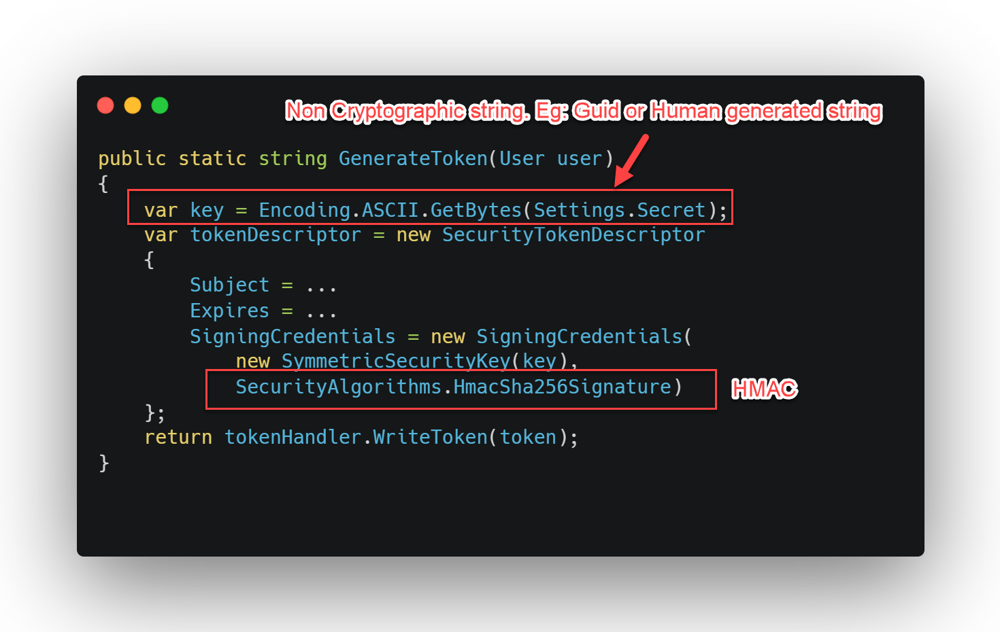

# JWT Key Management for .NET - Generate and auto rotate Cryptographic Keys for your Jwt (jws) / Jwe

One of the biggest problems in Key Management is: how to distribute keys in a secure way? HMAC relies on sharing the key between many projects. To solve it, `NetDevPack.Security.Jwt` uses a Public Key Cryptosystem to generate your keys, so you can share your public key at `https://<your_api_address>/jwks`!

<p align="center">
    
</p>

## Are you creating Jwt like this?
<p align="center">
    
</p>


## Let me tell you: You have a problem.

------------------
<br>

[](https://www.nuget.org/packages/NetDevPack.Security.Jwt)
[](https://github.com/NetDevPack/Security.Jwt/actions/workflows/publish.yml)
[](https://github.com/NetDevPack/Security.Jwt/actions/workflows/pull-request.yml)

The goal of this project is to help your application security by Managing your JWT.

* Auto create RSA or ECDsa keys
* Support for JWE
* Support public `jwks_uri` endpoint with your public key in JWKS format (Support for JWS and JWE)
* Extensions for your client API's to consume the JWKS endpoint. See more at [NetDevPack.Security.JwtExtensions](https://github.com/NetDevPack/Security.JwtExtensions)
* Auto rotate key every 90 days (Following NIST Best current practices for Public Key Rotation)
* Remove old private keys after key rotation (NIST Recommendations)
* Use recommended settings for RSA & ECDSA (RFC 7518 Recommendations)
* Uses random number generator to generate keys for JWE with AES CBC (dotnet does not support RSA-OAEP with Aes128GCM)
* By default, save keys in the same place as ASP.NET DataProtection (the same place where ASP.NET saves the keys used to protect MVC cookies)

It generates keys with RSA and ECDsa algorithms, which are the most recommended by [RFC 7518](https://datatracker.ietf.org/doc/html/rfc7518).

## Packages

| Package | NuGet | Description |
| ------- | ----- | ----------- |
| `NetDevPack.Security.Jwt` | [](https://www.nuget.org/packages/NetDevPack.Security.Jwt) | Core: key generation, rotation, `IJwtService`, DataProtection and InMemory stores |
| `NetDevPack.Security.Jwt.AspNetCore` | [](https://www.nuget.org/packages/NetDevPack.Security.Jwt.AspNetCore) | `/jwks` endpoint and `JwtBearer` validation integration |
| `NetDevPack.Security.Jwt.Store.EntityFrameworkCore` | [](https://www.nuget.org/packages/NetDevPack.Security.Jwt.Store.EntityFrameworkCore) | Persist keys in a database |
| `NetDevPack.Security.Jwt.Store.FileSystem` | [](https://www.nuget.org/packages/NetDevPack.Security.Jwt.Store.FileSystem) | Persist keys in a folder |
| `NetDevPack.Security.Jwt.IdentityServer4` | [](https://www.nuget.org/packages/NetDevPack.Security.Jwt.IdentityServer4) | ⚠️ **Deprecated** - IdentityServer4 key material |

### Supported frameworks

All packages target **.NET 8, .NET 9 and .NET 10**.

> **Breaking change in v10:** `netstandard2.1` is no longer supported (it pulled EF Core 3.1, which is out of support). If you need it, stay on v9.x.

## Token Validation

```c#
builder.Services.AddAuthentication(JwtBearerDefaults.AuthenticationScheme).AddJwtBearer(options =>
{
    options.TokenValidationParameters = new TokenValidationParameters
    {
        ValidateIssuer = true,
        ValidateAudience = true,
        ValidateLifetime = true,
        ValidateIssuerSigningKey = true,
        ValidIssuer = "https://www.devstore.academy",
        ValidAudience = "NetDevPack.Security.Jwt.AspNet"
    };
});
builder.Services.AddAuthorization();
builder.Services.AddJwksManager().UseJwtValidation();
```

## Generating Tokens:

```c#
app.MapGet("/token", async (IJwtService jwtService) =>
{
    var handler = new JsonWebTokenHandler();
    var now = DateTime.UtcNow;
    var descriptor = new SecurityTokenDescriptor
    {
        Issuer = "https://www.devstore.academy", // <- Your website
        Audience = "NetDevPack.Security.Jwt.AspNet",
        IssuedAt = now,
        NotBefore = now,
        Expires = now.AddMinutes(60),
        Subject = new ClaimsIdentity(claims),
        SigningCredentials = await jwtService.GetCurrentSigningCredentials() // (RSA or ECDsa) auto generated key
    };
    return handler.CreateToken(descriptor);
});
```

<p align="center">
    
</p>

## Table of Contents ##

- [JWT Key Management for .NET - Generate and auto rotate Cryptographic Keys for your Jwt (jws) / Jwe](#jwt-key-management-for-net---generate-and-auto-rotate-cryptographic-keys-for-your-jwt-jws--jwe)
  - [Are you creating Jwt like this?](#are-you-creating-jwt-like-this)
  - [Let me tell you: You have a problem.](#let-me-tell-you-you-have-a-problem)
  - [Packages](#packages)
    - [Supported frameworks](#supported-frameworks)
  - [Token Validation](#token-validation)
  - [Generating Tokens:](#generating-tokens)
  - [Table of Contents](#table-of-contents)
- [🛡️ What is](#️-what-is)
- [ℹ️ Installing](#ℹ️-installing)
- [❤️ Token Generation](#️-token-generation)
- [✔️ Token Validation (JWS)](#️-token-validation-jws)
- [⛅ Multiple API's - Use Jwks](#-multiple-apis---use-jwks)
  - [Identity API (Who emits the token)](#identity-api-who-emits-the-token)
  - [Client API](#client-api)
- [💾 Storage](#-storage)
  - [Database](#database)
  - [File system](#file-system)
  - [In memory](#in-memory)
- [⚙️ Options](#️-options)
- [Samples](#samples)
- [Changing Algorithm](#changing-algorithm)
  - [Jws](#jws)
  - [Jwe](#jwe)
- [IdentityServer4 - Auto jwks\_uri Management](#identityserver4---auto-jwks_uri-management)
- [Why](#why)
  - [Load Balance scenarios](#load-balance-scenarios)
  - [Best practices](#best-practices)
- [Contributing](#contributing)
- [License](#license)

------------------

# 🛡️ What is


The JSON Web Key Set (JWKS) is a collection of public keys used for verifying JSON Web Tokens (JWTs) issued by an authorization server. This component's primary objective is to provide a centralized storage and key rotation for your JWKs while adhering to best practices in JWK generation. It features a plugin for IdentityServer4, enabling automatic rotation of the jwks_uri every 90 days and seamless management of your jwks_uri.

If your API or OAuth 2.0 is deployed under a Load Balancer in Kubernetes or Docker Swarm, this component is essential. Its functionality is similar to the DataProtection Key in ASP.NET Core.

This component generates, stores, and manages your JWKs while maintaining a centralized storage accessible across instances. By default, a new key is generated every three months.

You can expose your JWKs through a JWKS endpoint and share them with your APIs.

# ℹ️ Installing

To install the core package in your API, use the following command in the NuGet Package Manager console:

```bash
Install-Package NetDevPack.Security.Jwt
```

Alternatively, you can use the .NET command line interface:

```bash
dotnet add package NetDevPack.Security.Jwt
```

For ASP.NET Core integration (`/jwks` endpoint and `JwtBearer` validation) also install:

```bash
dotnet add package NetDevPack.Security.Jwt.AspNetCore
```

Next, register the component in your `Program.cs`:

```c#
builder.Services.AddJwksManager().UseJwtValidation();
```

# ❤️ Token Generation

In most cases, when we say JWT, we're actually referring to JWS.


```c#
public class AuthController : ControllerBase
{
    private readonly IJwtService _jwtService;

    public AuthController(IJwtService jwtService)
    {
        _jwtService = jwtService;
    }

    private async Task<string> GenerateToken(ClaimsIdentity identityClaims)
    {
        var handler = new JsonWebTokenHandler();
        var currentIssuer = $"{Request.Scheme}://{Request.Host}";

        return handler.CreateToken(new SecurityTokenDescriptor
        {
            Issuer = currentIssuer,
            Subject = identityClaims,
            Expires = DateTime.UtcNow.AddHours(1),
            SigningCredentials = await _jwtService.GetCurrentSigningCredentials() // (RSA or ECDsa) auto generated key
        });
    }
}
```

# ✔️ Token Validation (JWS)

Use the same service to get the current key and validate the token.

```csharp
private async Task<bool> ValidateToken(string jwt)
{
    var handler = new JsonWebTokenHandler();
    var currentIssuer = $"{Request.Scheme}://{Request.Host}";

    var result = await handler.ValidateTokenAsync(jwt,
        new TokenValidationParameters
        {
            ValidIssuer = currentIssuer,
            ValidateAudience = false,
            IssuerSigningKey = await _jwtService.GetCurrentSecurityKey()
        });

    return result.IsValid;
}
```

# ⛅ Multiple API's - Use Jwks

A major challenge in key management is securely distributing keys. HMAC depends on sharing a key among multiple projects. To address this, `NetDevPack.Security.Jwt` employs a Public Key Cryptosystem for generating keys. As a result, you can share your public key at `https://<your_api_address>/jwks`!

**Piece of cake 🎂**

## Identity API (Who emits the token)

Install `NetDevPack.Security.Jwt.AspNetCore` in the API that issues JWT Tokens. Change your `Program.cs`:

```csharp
builder.Services.AddJwksManager().UseJwtValidation();

var app = builder.Build();

app.UseJwksDiscovery(); // exposes the public keys at /jwks (pass another path if you want)
```

Generating the token:

```csharp
private async Task<string> EncodeToken(ClaimsIdentity identityClaims)
{
    var handler = new JsonWebTokenHandler();
    var currentIssuer = $"{Request.Scheme}://{Request.Host}";

    return handler.CreateToken(new SecurityTokenDescriptor
    {
        Issuer = currentIssuer,
        Subject = identityClaims,
        Expires = DateTime.UtcNow.AddHours(1),
        SigningCredentials = await _jwtService.GetCurrentSigningCredentials()
    });
}
```

## Client API

In your Client API, where JWT validation is required, install `NetDevPack.Security.JwtExtensions`. Next, update your `Program.cs`:


```csharp
builder.Services.AddAuthentication(JwtBearerDefaults.AuthenticationScheme).AddJwtBearer(x =>
{
    x.RequireHttpsMetadata = true;
    x.SaveToken = true; // keep the public key at Cache for 10 min.
    x.IncludeErrorDetails = true; // <- great for debugging
    x.SetJwksOptions(new JwkOptions("https://localhost:5001/jwks"));
});
builder.Services.AddAuthorization();

var app = builder.Build();

app.UseAuthentication();
app.UseAuthorization();
```

At your `Controller`:

```csharp
[Authorize]
public class IdentityController : ControllerBase
{
    public IActionResult Get()
    {
        return new JsonResult(from c in User.Claims select new { c.Type, c.Value });
    }
}
```

Done 👌!

# 💾 Storage

By default, `NetDevPack.Security.Jwt` stores keys in the same location where ASP.NET Core stores its Cryptographic Key Material. It uses the [IXmlRepository](https://github.com/dotnet/aspnetcore/blob/d8906c8523f071371ce95d4e2d2fdfa89858047e/src/DataProtection/DataProtection/src/KeyManagement/XmlKeyManager.cs).

Any changes made to DataProtection will apply to this as well.

You can override the default behavior by adding another provider and customizing it according to your needs.

## Database

The `NetDevPack.Security.Jwt.Store.EntityFrameworkCore` package stores your keys in a database using Entity Framework Core.

Install via NuGet Package Manager:
```
Install-Package NetDevPack.Security.Jwt.Store.EntityFrameworkCore
```

Or through the .NET command line interface:

```
dotnet add package NetDevPack.Security.Jwt.Store.EntityFrameworkCore
```

Add `ISecurityKeyContext` to your DbContext:

``` c#
public class MyKeysContext : DbContext, ISecurityKeyContext
{
    public MyKeysContext(DbContextOptions<MyKeysContext> options) : base(options) { }

    // This maps to the table that stores keys.
    public DbSet<KeyMaterial> SecurityKeys { get; set; }
}
```

Then change your configuration at `Program.cs`:
```csharp
builder.Services.AddJwksManager().PersistKeysToDatabaseStore<MyKeysContext>();
```

Done!

## File system

The `NetDevPack.Security.Jwt.Store.FileSystem` package stores your keys in a folder.

Install
```
Install-Package NetDevPack.Security.Jwt.Store.FileSystem
```

Or via the .NET command line interface:

```
dotnet add package NetDevPack.Security.Jwt.Store.FileSystem
```

Now change your `Program.cs`:

``` c#
builder.Services.AddJwksManager().PersistKeysToFileSystem(new DirectoryInfo(@"c:\temp-keys\"));
```

## In memory

Useful for tests and local development (keys are lost when the app restarts):

``` c#
builder.Services.AddJwksManager().PersistKeysInMemory();
```

# ⚙️ Options

```c#
builder.Services.AddJwksManager(o =>
{
    o.DaysUntilExpire = 90;                     // key rotation period
    o.AlgorithmsToKeep = 2;                     // how many keys per use (sig/enc) are published at /jwks
    o.CacheTime = TimeSpan.FromMinutes(15);     // sliding cache for the current key
    o.KeyPrefix = $"{Environment.MachineName}_";
});
```

# Samples

You can find several examples [here](samples):

| Sample | What it shows |
| ------ | ------------- |
| [1_AspNet.Default](samples/1_AspNet.Default) | Minimal API generating/validating JWS and JWE with the default (DataProtection) store |
| [2_AspNet.Store.EntityFramework](samples/2_AspNet.Store.EntityFramework) | Same as above, persisting keys with EF Core |
| [3_IdentityServer4](samples/3_IdentityServer4) | ⚠️ Deprecated IdentityServer4 integration |
| [Microservice.Sample](samples/Microservice.Sample) | Identity API exposing `/jwks` + client API validating through `NetDevPack.Security.JwtExtensions` |

# Changing Algorithm

It's possible to modify the default algorithm during the configuration process.

``` c#
builder.Services.AddJwksManager(o =>
{
    o.Jws = Algorithm.Create(DigitalSignaturesAlgorithm.EcdsaSha256);
    o.Jwe = Algorithm.Create(EncryptionAlgorithmKey.RsaOAEP).WithContentEncryption(EncryptionAlgorithmContent.Aes128CbcHmacSha256);
});
```

By default, it uses recommended algorithms according to [RFC7518](https://datatracker.ietf.org/doc/html/rfc7518):

```c#
o.Jws = Algorithm.Create(AlgorithmType.RSA, JwtType.Jws); // PS256 (RSA SSA-PSS + SHA256)
o.Jwe = Algorithm.Create(AlgorithmType.RSA, JwtType.Jwe); // RSA-OAEP + A128CBC-HS256
```

When the configured key type changes (e.g. RSA → ECDsa), a new key is generated automatically on the next request.

The Algorithm object offers a variety of options to choose from.

## Jws

Algorithms:

| Shortname | Name              |
| --------- | ----------------- |
| HS256     | Hmac Sha256       |
| HS384     | Hmac Sha384       |
| HS512     | Hmac Sha512       |
| RS256     | Rsa Sha256        |
| RS384     | Rsa Sha384        |
| RS512     | Rsa Sha512        |
| PS256     | Rsa SsaPss Sha256 |
| PS384     | Rsa SsaPss Sha384 |
| PS512     | Rsa SsaPss Sha512 |
| ES256     | Ecdsa Sha256      |
| ES384     | Ecdsa Sha384      |
| ES512     | Ecdsa Sha512      |

## Jwe

Algorithms options:

| Shortname | Key Management Algorithm |
| --------- | ------------------------ |
| RSA1_5    | RSA1_5                   |
| RsaOAEP   | RSAES OAEP using         |
| A128KW    | A128KW                   |
| A256KW    | A256KW                   |

Encryption options

| Shortname           | Content Encryption Algorithm |
| ------------------- | ---------------------------- |
| Aes128CbcHmacSha256 | A128CBC-HS256                |
| Aes192CbcHmacSha384 | A192CBC-HS384                |
| Aes256CbcHmacSha512 | A256CBC-HS512                |


# IdentityServer4 - Auto jwks_uri Management

> ⚠️ **Deprecated.** IdentityServer4 reached end of life in 2022 and has known vulnerabilities ([GHSA-55p7-v223-x366](https://github.com/advisories/GHSA-55p7-v223-x366), [GHSA-ff4q-64jc-gx98](https://github.com/advisories/GHSA-ff4q-64jc-gx98)). The package is kept only for backward compatibility and will not receive new features. Consider migrating to [Duende IdentityServer](https://duendesoftware.com/products/identityserver) or [OpenIddict](https://github.com/openiddict/openiddict-core).

`NetDevPack.Security.Jwt` provides `IdentityServer4` key material. It auto generates and rotates the key.


First install
```
Install-Package NetDevPack.Security.Jwt.IdentityServer4
```

Or via the .NET command line interface:

```
dotnet add package NetDevPack.Security.Jwt.IdentityServer4
```

Go to `Startup.cs`

``` c#
public void ConfigureServices(IServiceCollection services)
{
    var builder = services.AddIdentityServer()
        .AddInMemoryIdentityResources(Config.GetIdentityResources())
        .AddInMemoryApiResources(Config.GetApis())
        .AddInMemoryClients(Config.GetClients());

    services.AddJwksManager().IdentityServer4AutoJwksManager();
}
```

If you want to use a database, follow the [Database](#database) instructions instead.

# Why

When developing applications and APIs using OAuth 2.0 or simply signing a JWT, various algorithms are supported. Among these algorithms, some are considered best practices and superior to others, such as RSA-PSS (PS256) or Elliptic Curve (ES256). Certain Auth servers operate with deterministic algorithms, while others use probabilistic ones. Some servers, like Auth0, do not support multiple JWKs, but IdentityServer4 supports as many as you configure. This component is designed to abstract this layer and offer your application the current best practices for JWK management.

## Load Balance scenarios

When working with containers in Kubernetes or Docker Swarm, scaling your applications can lead to certain issues, such as needing to store DataProtection keys in a centralized location. While it is not recommended to bypass this situation, using symmetric keys is one possible solution. Similar to DataProtection, this component provides a centralized store for your JWKS.

## Best practices

Many developers are unsure about which algorithm to use for signing their JWTs. By default, this component signs with RSA SSA-PSS using SHA-256 (PS256) and encrypts with RSA-OAEP + A128CBC-HS256. If you prefer Elliptic Curves, switch to ECDSA P-256 (ES256) with one line (see [Changing Algorithm](#changing-algorithm)). It simplifies JWKS management by providing a better understanding of best practices and ensuring the use of secure algorithms.

---------------

# Contributing

See [CONTRIBUTING.md](CONTRIBUTING.md). Architecture notes, decisions (ADRs) and the dependency policy live in the [docs/](docs/00-Index.md) folder (it's an [Obsidian](https://obsidian.md) vault, but plain Markdown works too).

# License

NetDevPack.Security.Jwt is Open Source software and is released under the MIT license. This license allows the use of NetDevPack.Security.Jwt in free and commercial applications and libraries without restrictions.
